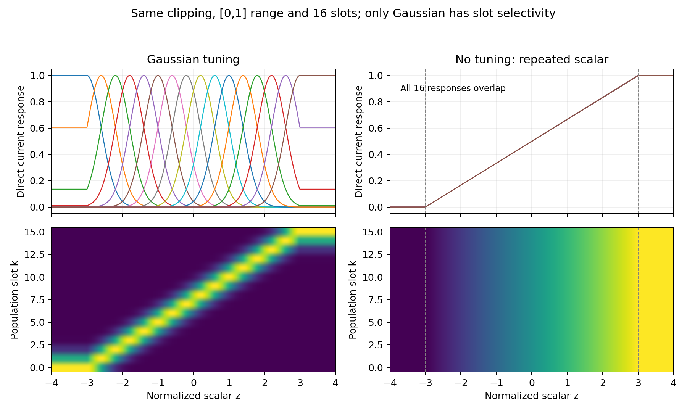

# Population tuning ablation — 96 new ETT runs

ETT 4 datasets × horizons 96/720 × seeds 7/13/21 × Gaussian/repeated scalar × temporal SSA/no SSA. Input 96, patch/stride 8, direct, K16/D64, two-stage head, max 10 epochs/patience 3. Select minimum validation MSE and evaluate all test windows.

Only the tuning response changes within each pair. Both clip to [-3,3]; repeat maps the scalar affinely to [0,1] and copies it across K slots. Shape, trainable parameter count and initial state hashes match in all 48 pairs. No population identity is used. Repeated slots do not offer independent feature diversity.

## Macro metrics

Average eight tasks within each seed first; mean ± sample SD below is across three seed means.

| Variant | MSE mean ± SD | MAE mean ± SD |
|---|---:|---:|
| temporal_gaussian | 0.380714 ± 0.000697 | 0.402519 ± 0.000602 |
| temporal_repeat | 0.395050 ± 0.001073 | 0.408129 ± 0.000651 |
| no_attention_gaussian | 0.381705 ± 0.001340 | 0.402975 ± 0.000896 |
| no_attention_repeat | 0.398110 ± 0.001580 | 0.409543 ± 0.001031 |

## Training budget and firing diagnostics

| Variant | Epoch range | Reached 10 epochs / 24 | Best at epoch 10 / 24 | Test first-batch embedding firing range |
|---|---:|---:|---:|---:|
| temporal_gaussian | 4–6 | 0/24 | 0/24 | 4.18–5.84% |
| temporal_repeat | 4–10 | 9/24 | 5/24 | 2.99–13.86% |
| no_attention_gaussian | 4–9 | 0/24 | 0/24 | 4.22–5.50% |
| no_attention_repeat | 4–10 | 5/24 | 1/24 | 2.86–12.77% |

Firing ranges describe only the first test batch of each run; they are not full-split rates or energy estimates. Reaching the epoch limit, especially with the best score at that limit, leaves convergence unresolved.

## Paired coding effect

Gaussian minus repeated scalar; negative means Gaussian is better. No p-values or convergence claim.

| SSA | Metric | Macro delta mean ± SD | Mean task-relative change (%) ± SD | Wins / 24 | Tasks won on mean / 8 | Tasks won in all seeds / 8 |
|---|---|---:|---:|---:|---:|---:|
| temporal | mse | -0.014335 ± 0.001226 | -3.051788 ± 0.285636 | 19/24 | 6/8 | 6/8 |
| temporal | mae | -0.005610 ± 0.000580 | -1.153928 ± 0.142770 | 19/24 | 6/8 | 6/8 |
| no_attention | mse | -0.016405 ± 0.001385 | -3.426393 ± 0.329456 | 19/24 | 6/8 | 6/8 |
| no_attention | mae | -0.006568 ± 0.000613 | -1.364138 ± 0.129129 | 18/24 | 6/8 | 5/8 |

Relative changes are computed per matched task/seed before averaging; they are not ratios of the macro MSE values.

Interaction is (Gaussian−repeat with SSA) − (Gaussian−repeat without SSA). Negative means the coding advantage is larger with SSA.

- MSE: 0.002070 ± 0.001679
- MAE: 0.000958 ± 0.000484

## Interpretation

- temporal: Gaussian has lower MSE in 19/24 seed-task pairs and all three seeds in 6/8 tasks. Tasks without a mean MSE improvement: ETTm1/96, ETTm2/720.
- no_attention: Gaussian has lower MSE in 19/24 seed-task pairs and all three seeds in 6/8 tasks. Tasks without a mean MSE improvement: ETTm1/96, ETTm2/720.

Fixed Gaussian tuning helps on average against this deletion control under the short fixed training budget, with and without SSA. This supports a coding contribution in the current prototype; it does not establish a general advantage over an independently optimized raw-input model. The repeat controls hitting the epoch cap leave the longer-training comparison open.

## Per-task MSE: mean ± sample SD

| Dataset | Horizon | SSA Gaussian | SSA repeat | No SSA Gaussian | No SSA repeat |
|---|---:|---:|---:|---:|---:|
| ETTh1 | 96 | 0.3902 ± 0.0023 | 0.4109 ± 0.0075 | 0.3943 ± 0.0034 | 0.4172 ± 0.0011 |
| ETTh1 | 720 | 0.4929 ± 0.0084 | 0.5629 ± 0.0078 | 0.4990 ± 0.0099 | 0.5807 ± 0.0119 |
| ETTh2 | 96 | 0.3079 ± 0.0021 | 0.3192 ± 0.0081 | 0.3102 ± 0.0016 | 0.3191 ± 0.0062 |
| ETTh2 | 720 | 0.4352 ± 0.0003 | 0.4491 ± 0.0053 | 0.4374 ± 0.0035 | 0.4489 ± 0.0020 |
| ETTm1 | 96 | 0.3507 ± 0.0006 | 0.3490 ± 0.0027 | 0.3465 ± 0.0021 | 0.3462 ± 0.0051 |
| ETTm1 | 720 | 0.4646 ± 0.0014 | 0.4717 ± 0.0019 | 0.4640 ± 0.0021 | 0.4738 ± 0.0018 |
| ETTm2 | 96 | 0.1836 ± 0.0025 | 0.1869 ± 0.0010 | 0.1820 ± 0.0010 | 0.1866 ± 0.0013 |
| ETTm2 | 720 | 0.4207 ± 0.0086 | 0.4108 ± 0.0034 | 0.4202 ± 0.0086 | 0.4124 ± 0.0035 |

## Per-task MAE: mean ± sample SD

| Dataset | Horizon | SSA Gaussian | SSA repeat | No SSA Gaussian | No SSA repeat |
|---|---:|---:|---:|---:|---:|
| ETTh1 | 96 | 0.4103 ± 0.0010 | 0.4221 ± 0.0030 | 0.4127 ± 0.0038 | 0.4242 ± 0.0011 |
| ETTh1 | 720 | 0.4831 ± 0.0036 | 0.5156 ± 0.0020 | 0.4847 ± 0.0047 | 0.5234 ± 0.0054 |
| ETTh2 | 96 | 0.3587 ± 0.0027 | 0.3629 ± 0.0047 | 0.3593 ± 0.0018 | 0.3622 ± 0.0035 |
| ETTh2 | 720 | 0.4541 ± 0.0017 | 0.4591 ± 0.0039 | 0.4565 ± 0.0049 | 0.4596 ± 0.0002 |
| ETTm1 | 96 | 0.3823 ± 0.0018 | 0.3799 ± 0.0021 | 0.3805 ± 0.0009 | 0.3783 ± 0.0035 |
| ETTm1 | 720 | 0.4481 ± 0.0015 | 0.4512 ± 0.0010 | 0.4467 ± 0.0015 | 0.4510 ± 0.0013 |
| ETTm2 | 96 | 0.2683 ± 0.0017 | 0.2694 ± 0.0009 | 0.2681 ± 0.0033 | 0.2712 ± 0.0015 |
| ETTm2 | 720 | 0.4152 ± 0.0043 | 0.4049 ± 0.0016 | 0.4153 ± 0.0051 | 0.4063 ± 0.0019 |

## Logging and checks

Each run uses neorecall-style date/config/seed directories with log/best_log_0.csv, log/final+result.csv, TensorBoard train_0/val_0, logargs.txt and model_state/config.pt + best+model.pt. per_run.csv locates each log. CSV values have six decimals; JSON preserves full precision. Full split counts, checkpoints, CSV/history agreement, source/config/data equality and paired initialization are checked.

Maximum absolute MSE difference between newly trained Gaussian runs and their historical counterparts: 0. Historical runs are not reused in these statistics.

## Limits

This estimates the effect of fixed Gaussian tuning against a clipped affine repeat control in the specified SNN. Same nominal parameter count does not mean the repeat control has independent K-slot features. Identical repeated features also couple the head gradients; this is a deletion ablation within this architecture, not proof that Gaussian coding is superior to every raw-input SNN. An independently optimized raw projection/K1 model, learned Gaussian centers/widths, longer training and energy measurements were not run. Three seeds share the same data splits; they measure initialization/order variability, not independent dataset replication. SSA on/off have different parameter sets; exact initialization matching applies within each coding pair.
